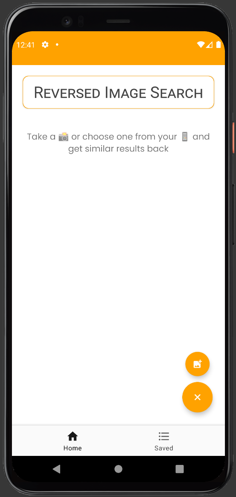
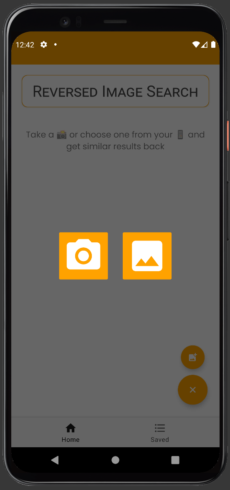
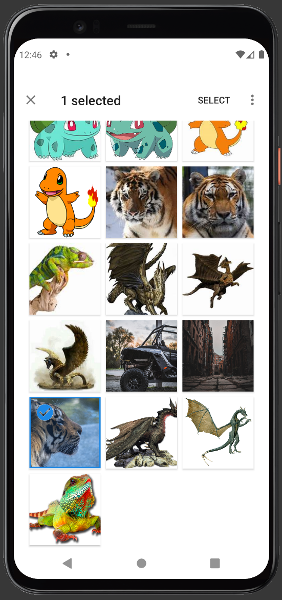
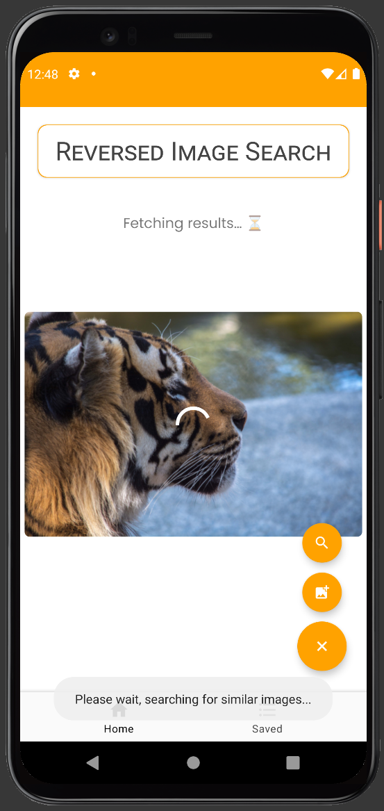
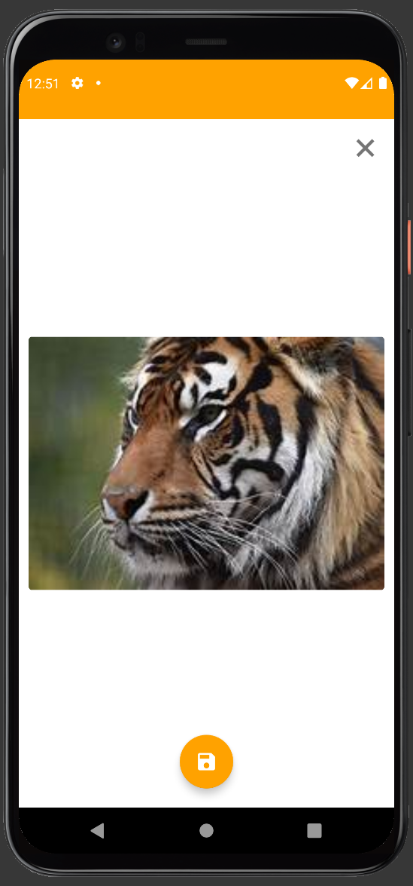
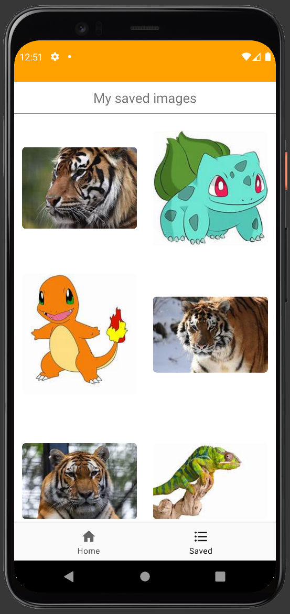

> PGR208 Android Programming exam
<h1 align="center">
Reversed Image Search 🖼🔍📱✍(◔◡◔) EXAM
</h1>

The API's may be down, or may not be down. I don't watch it anymore.

---

#### 1 Startscreen

#### 2 Choose gallery or camera

   
#### 3 Choose image from gallery

   
#### 4 Image chosen

   
#### 5 Searching for results

#### 6 Result

#### 7 Fullscreen result

### 8 Saved images

